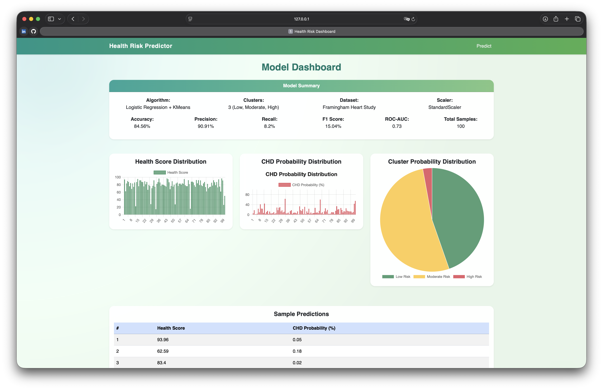

# Health Risk Predictor

A Machine Learning based system that predicts the **10-year risk of Coronary Heart Disease (CHD)** using health parameters and provides a **health score and insurance recommendation**.

Developed as part of **Machine Learning for Data Analytics (MLDA)**.

---

## Project Overview

Cardiovascular diseases are one of the leading causes of death worldwide.  
This project uses **Machine Learning and clustering techniques** to predict health risks based on medical parameters.

The system:

• Predicts CHD probability  
• Calculates a health score using clustering  
• Classifies users into risk groups  
• Recommends suitable insurance plans  

---

## Technologies Used

**Programming**
- Python

**Machine Learning**
- Scikit-learn
- KMeans Clustering
- Logistic Regression

**Backend**
- Flask

**Frontend**
- HTML
- CSS
- Bootstrap
- Chart.js

**Data Processing**
- Pandas
- NumPy

---

## Dataset

Dataset used:

**Framingham Heart Study Dataset**

Features include:

- Age
- Gender
- Smoking status
- Cigarettes per day
- Diabetes
- Hypertension
- BMI
- Heart rate
- Glucose
- Cholesterol
- Pulse pressure

Target variable:

```
TenYearCHD
```

---

## Machine Learning Pipeline

1. Data Loading  
2. Data Preprocessing  
3. Feature Scaling (StandardScaler)  
4. Logistic Regression Model Training  
5. CHD Probability Prediction  
6. Health Score Generation using **KMeans Clustering**  
7. Risk Group Classification  
8. Insurance Plan Recommendation  

---

## Risk Categories

The clustering model divides individuals into:

| Cluster | Risk Level |
|------|------|
| Cluster 0 | Low Risk |
| Cluster 1 | Moderate Risk |
| Cluster 2 | High Risk |

---

## Model Performance

| Metric | Value |
|------|------|
| Accuracy | ~85% |
| Precision | ~91% |
| Recall | ~82% |
| F1 Score | ~15% |
| ROC-AUC | ~0.73 |

---

## System Architecture


---

## Dashboard Features

The system dashboard visualizes:

• Health Score Distribution  
• CHD Probability Distribution  
• Cluster Distribution  
• Model Performance Metrics  

---

## Local Setup and Running the Project

Follow the steps below to run the Health Risk Predictor on your local machine.

### 1. Clone the Repository

Open a terminal and run:

git clone https://github.com/Mohan-Narayanapuram/health-risk-predictor.git

Then navigate into the project directory:

cd health-risk-predictor

---

### 2. Create a Virtual Environment

Create a Python virtual environment to isolate project dependencies.

python -m venv venv

---

### 3. Activate the Virtual Environment

Mac / Linux:

source venv/bin/activate

Windows:

venv\Scripts\activate

After activation, your terminal prompt should display something similar to:

(venv)

---

### 4. Install Required Dependencies

Install all required Python packages using the requirements file.

pip install -r requirements.txt

---

### 5. Run the Flask Application

Start the application by running:

python frontend/app.py

---

### 6. Open the Application in a Browser

Once the server starts successfully, open a web browser and go to:

http://127.0.0.1:5000

This will open the Health Risk Predictor interface where you can enter health parameters and obtain predictions.

---

### Expected Workflow

1. Enter the required health information in the input form.
2. Submit the form to generate predictions.
3. View the predicted CHD probability and calculated health score.
4. Review the recommended insurance plan.
5. Access the dashboard page to see model statistics and visualizations.

---

### Troubleshooting

If port 5000 is already in use, identify the running process:

lsof -i :5000

Terminate the process or modify the port number in the Flask application.

---

## Application Preview

### Input Form


### Prediction Result


### Dashboard


---

## Project Structure

```
health-risk-predictor
│
├── architecture
├── data
│   ├── raw
│   └── processed
│
├── frontend
│   └── app.py
│
├── templates
├── static
│
├── src
│
├── models
│
├── main.py
│
└── README.md
```

---

## Developers

**Mohan Narayanapuram**  
RA2311056010126

**D. Pujith Ram Reddy**  
RA2311056010153

---

## License

This project was developed for **academic purposes**.
